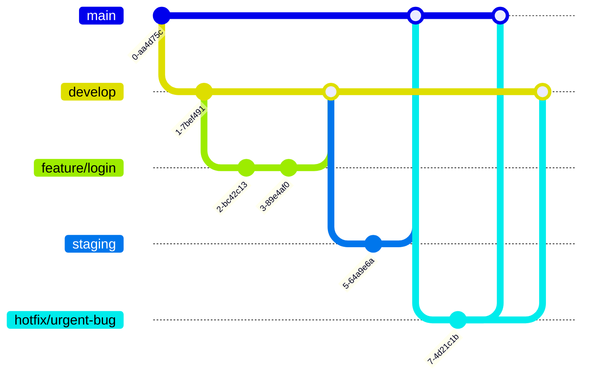

# Git Flow 브랜치 전략

## 브랜치 구조
- **main**
  - 실제 서비스/배포용 브랜치
  - 항상 배포 가능한 상태 유지
- **staging**
  - 배포 전 테스트 환경
  - main에 머지하기 전에 QA/테스트 진행
- **develop**
  - 기본 개발 브랜치
  - 새로운 기능(feature) 브랜치의 병합 대상
- **feature/**
  - 새로운 기능/작업 단위 개발용
  - `develop`에서 분기, 완료 후 `develop`으로 머지
  - 예: `feature/user-login`, `feature/add-report`
- **hotfix/**
  - 운영 중 긴급 버그 수정용
  - `main`에서 분기, 수정 후 `main`과 `develop` 양쪽에 머지
  - 예: `hotfix/fix-login-error`

## 브랜치 흐름

## 커밋 메시지 규칙 (예시)
- `[ADD]`: 신규 기능 추가
- `[UPDATE]`: 기존 기능/코드 변경
- `[FIX]`: 버그 수정
- `[DEL]`: 코드/파일 삭제

## Pull Request 규칙
- 모든 브랜치 병합은 Pull Request를 통해 진행
- 리뷰 최소 1명 이상 승인 필요
- PR 제목: `[브랜치명] 작업 요약`
- PR 설명: 변경 내용, 테스트 방법, 주의사항 명시

## 기타 권장 사항
- 브랜치 이름은 소문자/하이픈(`-`) 권장
- 작은 단위로 자주 커밋
- 커밋 메시지는 한글/영문 혼용 가능하되 일관성 유지
